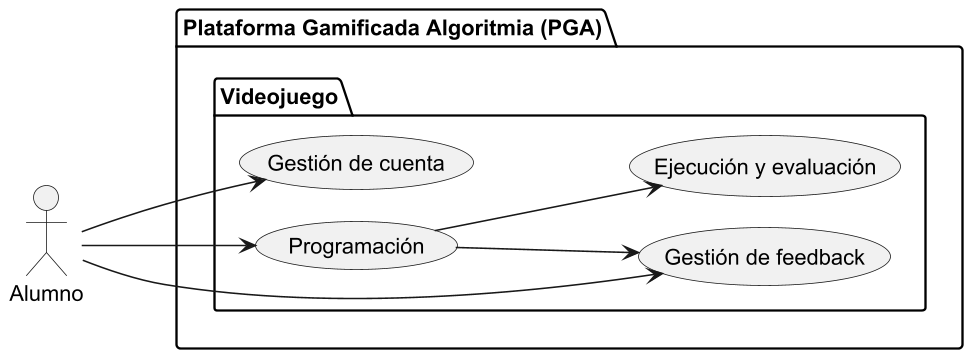
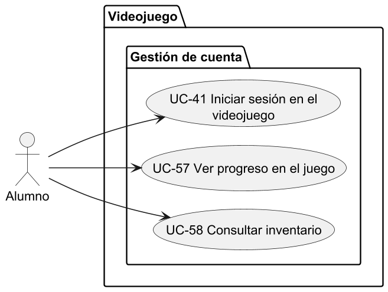
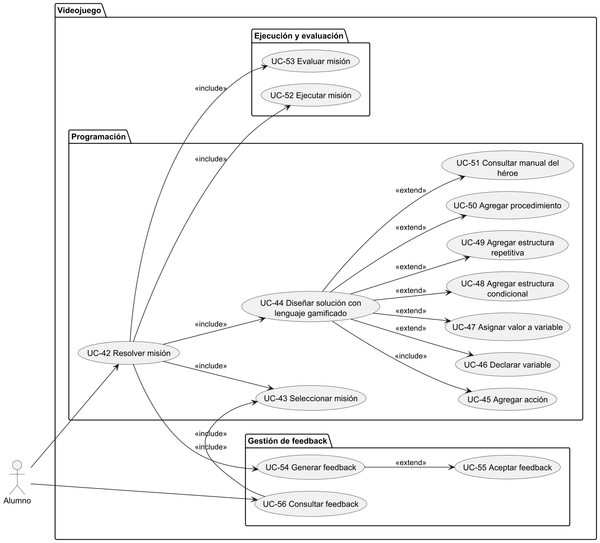
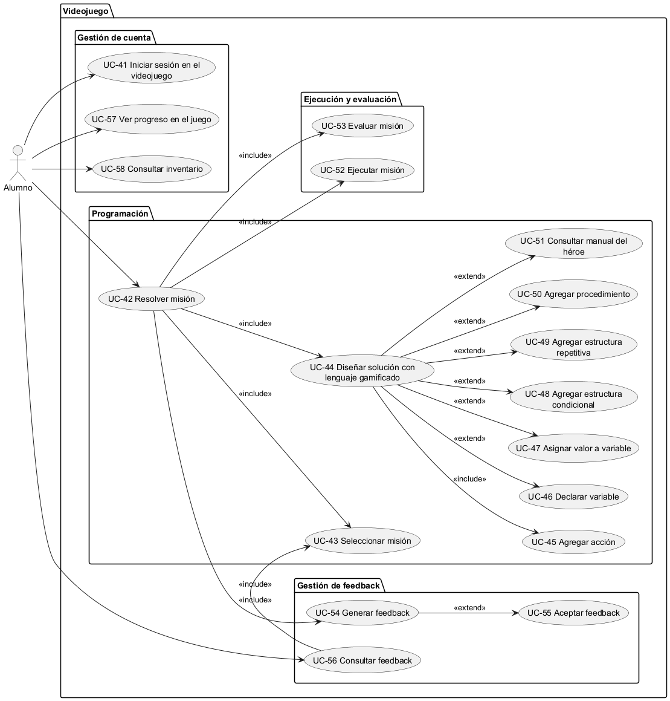

# Modelo de Casos de Uso

**Versión:** 1.0
**Fecha:** 21/06/2025
**Autor(es):** Franco Andrés Albornoz

---

## Actores del sistema

### ACT-01 Alumno

Representa a los estudiantes que utilizarán el videojuego desarrollado en Godot como herramienta principal para practicar y afianzar los contenidos de la materia "Algoritmos y Estructuras de Datos I".

Los alumnos podrán registrarse en la plataforma web mediante un formulario tradicional o autenticarse con Google. Una vez registrados, inciarán sesión y se uniran a un curso ingresando un nombre de curso y contraseña provistos por el docente. Una vez unido a un curso, podrán descargar el videojuego e iniciar sesión con su usuario y contraseña para establecer sus datos y sincronizar el progreso que realicen.

Dentro del videojuego, podrán:

- Consultar y resolver misiones gamificadas.
- Recibir feedback formativo automático tras cada intento.
- Obtener puntuaciones, experiencia y subir de nivel.
- Desbloquear nuevas habilidades y capítulos de la historia según el progreso.
- Consultar sus estadísticas personales dentro del juego.

Adicionalmente, podrán acceder a la plataforma web para:

- Unirse a un curso
- Cambiar la contraseña
- Consultar recursos de apoyo (manual del héroe, tutoriales, etc.).
- Ver estadísticas más detalladas de su rendimiento.
- Confirmar asistencia a sesiones de refuerzo, ya sea desde la web o a través del enlace recibido por correo electrónico.

---

### ACT-02 Docente

Representa al personal docente encargado de dictar la materia y brindar seguimiento académico a los alumnos. Los docentes utilizarán exclusivamente la plataforma web, donde tendrán acceso a diversas funcionalidades de gestión académica.

Sus principales responsabilidades incluyen:

- Gestionar los cursos a su cargo (asignados previamente por el administrador) de manera limitada.
  - Modificar la contraseña de acceso del curso para nuevos alumnos.
  - Validar y aceptar solicitudes de ingreso de alumnos a sus cursos.
- Visualizar en tiempo real el avance y desempeño de sus alumnos (misiones resueltas, errores frecuentes, actividad reciente, etc.).
- Generar reportes académicos filtrados por curso, capítulo o estudiante.
- Programar sesiones de refuerzo para alumnos con bajo rendimiento o inactividad prolongada.

---

### ACT-03 Administrador

Representa al administrador general del sistema. Es responsable de mantener la infraestructura organizativa y funcional del entorno académico.

Entre sus funciones se destacan:

- Registrar y gestionar instituciones educativas.
- Crear cursos y asignar docentes a los mismos.
- Gestionar usuarios del sistema (docentes, alumnos y otros administradores en el futuro).
- Auditar cambios realizados en las distintas entidades del sistema: altas, bajas, modificaciones de usuarios, cursos e instituciones.

En esta versión inicial, se prevé que exista un único administrador central. En versiones futuras, podría habilitarse un esquema con administradores por institución.

### ACT-04 Google OAuth 2.0
Representa al servicio externo de autenticación de Google utilizado por la plataforma web para permitir el inicio de sesión o registro de alumnos mediante sus cuentas de Google. Es un actor externo que colabora en los procesos de autenticación sin intervención directa del usuario sobre sus mecanismos internos.

<!--
## Casos de uso del sistema

### Administrador

#### Gestión de usuarios

- **UC-01** Alta usuario  
- **UC-02** Modificar usuario  
  - INCLUDE: **UC-03** Buscar usuario  
- **UC-04** Baja usuario  
  - INCLUDE: **UC-03** Buscar usuario  
- **UC-05** Iniciar sesión

#### Gestión de instituciones

- **UC-06** Alta de institución  
- **UC-07** Modificar institución  
  - INCLUDE: **UC-08** Buscar institución  
- **UC-09** Baja de institución  
  - INCLUDE: **UC-08** Buscar institución  

#### Gestión de cursos

- **UC-10** Alta de curso  
- **UC-11** Modificar curso  
  - INCLUDE: **UC-12** Buscar curso  
- **UC-13** Baja de curso  
  - INCLUDE: **UC-12** Buscar curso  
- **UC-14** Asignar docente a curso  
  - INCLUDE: **UC-15** Buscar docente  

#### Auditoría

- **UC-16** Auditoría

---

### Docentes

#### Gestionar seguimiento académico

- **UC-17** Consultar progreso de alumnos
  - EXTEND: **UC-18** Ver progreso general (historia)
  - EXTEND: **UC-19** Ver progreso por capítulo
- **UC-20** Generar reporte de progreso de alumnos

#### Gestionar sesiones de refuerzo
- **UC-21** Crear sesión de refuerzo
- **UC-22** Modificar sesión de refuerzo
  - INCLUDE: **UC-23** Buscar sesión de refuerzo
- **UC-24** Cancelar sesión de refuerzo
  - INCLUDE: **UC-23** Buscar sesión de refuerzo 
- **UC-25** Aceptar sesión de refuerzo automática

#### Gestionar cursos (docente)
- **UC-26** Definir días y horarios del curso
- **UC-27** Cambiar contraseña de acceso a curso
- **UC-28** Aprobar solicitud de ingreso al curso
- **UC-29** Habilitar capítulo
  - INCLUDE: **UC-30** Buscar capítulo

#### Gestión de cuenta
- **UC-05** Iniciar sesión
- **UC-31** Modificar datos personales

### Alumnos

#### Gestión de cuenta
- **UC-32** Registrarse en la plataforma
  - EXTEND: **UC-33** Registro normal
  - EXTEND: **UC-34** Registro con Google
- **UC-35** Iniciar sesión en la plataforma web
  - EXTEND: **UC-36** Iniciar sesión normal
  - EXTEND: **UC-37** Inicar sesión con Google
- **UC-31** Modificar datos personales
- **UC-38** Ver progreso en la web

#### Cursos
- **UC-39** Solicitar ingreso a curso
- **UC-40** Confirmar asistencia a sesión de refuerzo

#### Videojuego
- **UC-41** Iniciar sesión en el videojuego
- **UC-42** Resolver misión
  - INCLUDE: **UC-43** Seleccionar misión
  - INCLUDE: **UC-44** Diseñar solución con lenguaje gamificado
    - INCLUDE: **UC-45** Agregar acción
    - EXTEND: **UC-46** Declarar variable
    - EXTEND: **UC-47** Asignar valor a variable
    - EXTEND: **UC-48** Agregar estructura condicional
    - EXTEND: **UC-49** Agregar estructura repetitiva
    - EXTEND: **UC-50** Agregar procedimiento
    - EXTEND: **UC-51** Consultar manual del heroe
  - INCLUDE: **UC-52** Ejecutar misión
  - INCLUDE: **UC-53** Evaluar misión
  - INCLUDE: **UC-54** Generar feedback
    - EXTEND: **UC-55** Aceptar feedback
- **UC-56** Consultar feedback
  - INCLUDE: **UC-43** Seleccionar misión
- **UC-57** Ver progreso en el juego
- **UC-58** Consultar inventario
-->

## Diagrama de Casos de Uso - Videojuego
### Alto nivel - Subsistemas

#### Subsistema Gestión de cuenta

#### Subsistema Programación

### Expandido - DCU Completo

## Diagrama de Casos de Uso – Plataforma Web

