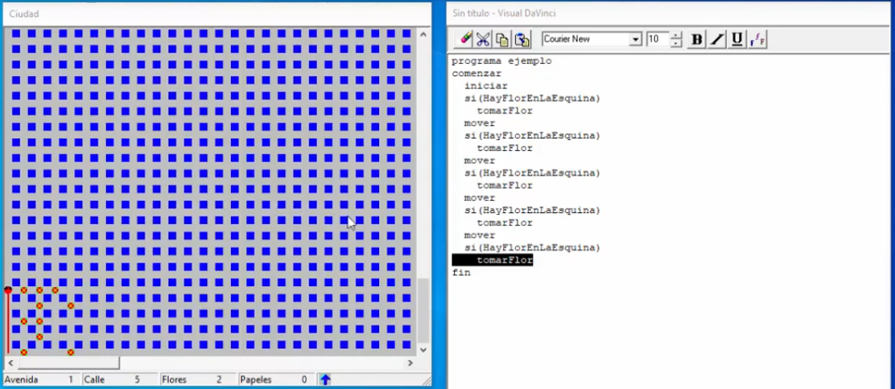

# Documento de Visión

**Versión:** 2.0
**Fecha:** 29/07/2025
**Autor(es):** Franco Andrés Albornoz

---

## 1. Introducción

### 1.1 Propósito

El proposito de este documento es proporcionar la información necesaria del proyecto a desarrollar. En este documento se podrá encontrar el contexto del negocio, los problemas o necesidades a abordar y el impacto que tendrá el desarrollo del software, asi como también la visión del producto explicada en objetivos y alcance del mismo.

### 1.2 Presentación general

El presente proyecto se trata del desarrollo de una plataforma de aprendizaje denominada "Plataforma Gamificada 'Algoritmia' (PGA)", que permitirá a los alumnos aprender algoritmos, lógica y estructuras de control incorporando “Gamificación” con mecánicas y componentes propios de los videojuegos para el aprendizaje y luciendo una estética visual de “Pixel Art”. Además, para los docentes permitirá el seguimiento académico exhaustivo de cada uno de los alumnos y el sistema podrá ser adaptado e incluido a cualquier institución educativa.

### 1.3 Participantes del proyecto

El equipo de desarrollo esta compuesto por el integrante Franco Andrés Albornoz, que cumple las funciones de gestor de proyecto, diseñador y desarrollador.
Participan también en el proyecto alumnos y docentes de la materia Algoritmos y Estructuras de Datos I.

---

## 2. Contexto de Negocio

### 2.1 Descripción del negocio

El desarrollo de este proyecto se sitúa en la Facultad de Ciencias Exactas, Químicas y Naturales (Módulo Apóstoles) de la Universidad Nacional de Misiones donde se dictan las carreras de informática: Analista en Sistemas de Computación (Pregrado, 3 años), Profesorado Universitario en Computación (Grado, 4 años) y Licenciatura en Sistemas de Información (Grado, 5 años).

En el plan de estudio de cada una de las carreras se encuentra la materia principal e introductora a los conceptos base para progresar en la carrera, la cual es sumamente importante: "Algoritmos y Estructuras de Datos I". La materia es anual, es decir que se dicta duante el primer cuatrimestre y segundo cuatrimestre del año lectivo.

El contenido de la materia se divide en los siguientes temas:

- Algoritmos y Secuencia
- Lógica proposicional
  - Operador lógico Y (AND)
  - Operador lógico O (OR)
  - Operador lógico NO (NOT)
  - Tablas de verdad
- Estructuras de control
  - Si - Sino (if-else)
  - Repetir
  - Mientras (while)
- Variables (enteros, caracteres, reales, ...)
  - Declaración y asignación
  - Variables globales
  - Variables locales
- Procedimientos
  - Con o sin parámetros de entrada, salida y entrada/salida
- Funciones
  - Con o sin parámetros de entrada, salida y entrada/salida
- Estructuras de datos
  - Cadena de caracteres (String)
  - Vectores y matrices (Arrays)
  - Registros (Record)
  - Archivos (Files)

Las clases se dividen en teoría y práctica y los días y horarios son los siguientes (al momento de la redacción de este documento):

- La **teoría** se dictan los Lunes de 10:00 AM a 12:00 PM. En la teoría se presenta mediante diapositivas el contenido teórico y fundamental del tema de la semana. Dicho contenido, luego de la clase, queda disponible en el aula virtual para que los alumnos puedan consultarlo en cualquier momento.
- La **práctica** se dictan los días lunes de 17:00 PM a 19:00 PM, miércoles de 10:30 AM a 12:30 PM. En las clases de práctica se llevan a cabo la presentación y resolución de los ejercicios y trabajos prácticos sobre los contenidos teóricos dados el día lunes.
- Adicionalmente, se tiene una clase de **consulta** los días jueves de 19:00 PM a 20:00 PM. La clase de consulta sirve para que los alumnos puedan, si asi lo requieren, llevar sus dudas inconclusas acerca de los temas o ejercicios y pedir una revisión de los ejercicios ya resueltos para obtener retroalimentación de los docentes.

Esta materia es la más importante al momento de ingresar a las carreras de informática, ya que su contenido es fundamental e indispensable para el avance de la carrera por su contenido y correlatividad. Por lo tanto, la cátedra busca garantizar que todos los alumnos puedan aprender de manera adecuada y poseer conocimientos sólidos y afianzados de los contenidos tanto teóricos como prácticos.

### 2.2 Problema o necesidad

Actualmente en la cátedra, las prácticas de los temas que van desde algoritmos hasta prodecimientos se llevan a cabo y se enfocan en el programa llamado "Visual DaVinci", el cual tiene como escenario a un robot que recorre una ciudad juntando flores y papeles en las esquinas de la misma. La ciudad está representada como una matriz de 100x100 y la misma tiene calles (filas), avenidas (columnas) y esquinas (intersección de una calle y una avenida).

Este programa ya se viene implementando hace muchos años en la cátedra, aproximadamente desde 2007. Permite realizar edición de codigo con una serie de instrucciones disponibles. El alumno puede diseñar un algoritmo para resolver distintos problemas y al momento de ejecutar se tiene un visor simulado la ciudad con cuadros azules, el robot con un punto rojo y negro, flores con un circulo rojo con centro amarillo y papeles con circulos blancos. Algunas de las instrucciones disponibles son:

- mover: el robot avanza a la siguiente esquina
- derecha: el robot gira a la derecha
- tomarFlor: el robot toma una flor en la esquina
- tomarPapel: el robot toma un papel en la esquina
- HayFlorEnLaEsquina: el robot se pregunta si existe una flor en la esquina en la que está posicionado actualmente.
- HayPapelEnLaEsquina: el robot se pregunta si existe un papel en la esquina en la que está posicionado actualmente.
- Pos(x, y): el robot salta se posiciona en la calle "x" y en la avenida "y".
- Entre otras...

Ejemplo del area de trabajo de Visual DaVinci.
Video Youtube: Visual DaVinci - Capítulo 2: Estructura si - ChamanDEV

Los principales problemas que se encuentran en esta plataforma es que el programa no brinda ningún tipo de sugerencia o dinámica de aprendizaje según el código que ejecutemos, sino que se limita solamente a la prueba del mismo. No evalúa indentación, repetición de primitivas o secuencia ineficiente, no ofrece ningún tipo de feedback para mejorar la solución propuesta. Además, debido a la antigüedad del sistema, su interfaz con componentes en su mayoría grises y pocos colores se quedó muy atrás y no resulta atractiva.

Aparte del programa, otro problema relacionado a la cátedra es que tienen problemas para llevar a cabo el **seguimiento** de los alumnos en cuanto a su nivel de aprendizaje y la toma de decisiones al respecto. Los docentes indican que “El seguimiento está en su cabeza”, es decir, no tienen una forma de llevar el seguimiento o progreso del alumno en su aprendizaje y conocimientos. Esto es otra cosa que el programa actual no permite, no se evidencia el progreso del alumno en el uso ni conocimientos aprendidos a lo largo del tiempo, no tiene dificultad progresiva ni presenta grandes desafios de mejora para el alumno.

Al ser la primera materia de la carrera, cada año se tiene una gran cantidad de alumnos cursando y llegado un punto del año se torna imposible para los docentes llevar un seguimiento y brindar apoyo adicional a aquellos alumnos que quedaron atrasados en los contenidos y que no lograron afianzar conocimientos.
Por otro lado, cada alumno que ingresa a la carrera tiene una personalidad diferente. Aquellos que son más introvertidos o con poca confianza, si se llegan a atrasar, les cuesta mucho tomar la iniciativa para solicitar apoyo de los docentes.

En resumen, los problemas específicos identificados son:

1. Baja motivación

   - Interfaz anticuada (tonos grises, componentes básicos) que no despierta interés.
   - Ausencia de alguna narrativa que enganche al estudiante.

2. Repetitividad

   - Flujos y primitivas siempre iguales, sin novedades que mantengan vivo el desafío.
   - Falta de progresión de dificultad estructurada.

3. Falta de feedback formativo.

   - Solo valida si el código funciona o no; no sugiere optimizaciones, mejoras de indentación o patrones eficientes.
   - No muestra métricas de calidad de código (reutilización de primitivas, complejidad cíclica).

4. Carencia de seguimiento académico.

   - Los docentes “llevan el seguimiento en la cabeza”: no existe registro centralizado de avances ni estadísticas de desempeño por alumno.
   - Imposible detectar a tiempo qué alumnos quedan rezagados o necesitan apoyo adicional.

5. Barreras de colaboración.
   - Estudiantes introvertidos o con baja confianza quedan aislados, al no existir mecanismos de colaboración.

### 2.3 Propuesta de solución

Teniendo en cuenta la situación actual y la problemática, se realizará una propuesta de solución: el desarrollo de una plataforma de aprendizaje denominada "Plataforma Gamificada 'Algoritmia' (PGA)", enfocada en el concepto de “Gamificación” y luciendo una estética visual de “Pixel Art”. La plataforma permitirá a los alumnos aprender algoritmos, lógica y estructuras de control y para los docentes permitirá el seguimiento académico exhaustivo de cada uno de los alumnos.

La solución estará compuesta por dos aplicaciones separadas pero integradas:

- Un **videojuego independiente**, desarrollado con Godot y GDScript, orientado exclusivamente a los alumnos. Este videojuego estará diseñado con una historia y narrativa dividida en capítulos temáticos y permitirá la resolución de misiones prediseñadas en un entorno con narrativa y mecánicas lúdicas, funcionando de forma offline y sincronizando el progreso académico a posteriori.
- Una **plataforma web**, destinada a docentes, administradores y en parte a los alumnos también. Esta le permitirá a los docentes hacer seguimiento del progreso de los alumnos, generar reportes y crear sesiones de refuerzo de contenidos. Para el administrador, le permitirá gestionar instituciones, cursos, asignación de docentes a los cursos y auditoría. Para los alumnos, permitirá el registro e inicio de sesión mediante Google, consulta de estadísticas y descarga del videojuego.

Ambas aplicaciones estarán conectadas a la misma base de datos, permitiendo que los datos de avance y resultados obtenidos por los estudiantes en el videojuego se reflejen luego en la plataforma web. El videojuego tambien funcionará de manera offline, permitiendo a los alumnos resolver misiones aun sin conexión. Una vez que se disponga de acceso a Internet, la aplicación sincronizará automáticamente el progreso acumulado con el backend, permitiendo que los datos estén disponibles en la parte web.

#### La gamificación

El concepto de "gamificación" se refiere a la aplicación de narrativa, mecánicas y elementos propios de los videojuegos (como niveles, experiencia, puntos, logros, desafíos, tablas de clasificación y recompensas) en contextos no lúdicos, como la educación y el trabajo.
Aumenta la motivación, participación y mejora la experiencia de aprendizaje haciendo que las personas sientan que están jugando. Esta técnica se utiliza para hacer que las actividades sean más interesantes, atractivas y divertidas aumentando el compromiso de los participantes. Algunos de los beneficios más importantes de la gamificación, según especialistas, son:

- **Incrementa la motivación**: potencia la predisposición del alumno a aprender y genera menor rechazo comparándolo con el estudio tradicional.
- **Brinda diferentes niveles de dificultad**: a medida que se avanza y completa los desafíos, éstos se vuelven cada vez más complejos.
- **Mejora la lógica y las estrategias para la resolución de problemas**: los estudiantes deberán utilizar el pensamiento lógico para resolver el problema que tienen delante con las herramientas disponibles.
- **Aumenta la atención y la concentración**: para los alumnos será como estar jugando un videojuego, y por ello se esforzarán, aumentará su motivación y comprenderán bien los contenidos.
- **Incrementa el rendimiento académico**: al entender los conceptos correctamente y estar motivado, hay altas probabilidades de que el alumno pueda aprobar sus exámenes con éxito.

#### Pixel Art

El pixel art es un estilo artístico digital utilizado para crear imágenes con píxeles individuales para formar un mosaico visual. Este estilo es reconocido por su estética retro y la conexión que tiene con los videojuegos clásicos, en donde la resolución y recursos eran limitados. Algunas de sus características son:

- **Creación pixel a pixel**: se centra en crear imágenes colocando un color en cada píxel individual. Es un estilo muy artesanal con el cual se pueden lograr resultados muy detallados pero con componentes simples.
- **Estilo retro**: el pixel art nos recuerda a los primeros videojuegos y computadoras, con paleta de colores limitada y gráficos de baja resolución.
- **Influencia en los videojuegos**: es un estilo popular en el diseño de videojuegos, donde se utiliza para crear sprites, personajes, entornos y gráficos de interfaz de usuario.

#### Oportunidades

El desarrollo de este sistema ofrece varias oportunidades tanto a alumnos como a docentes.
**Para alumnos**:

- Podrán aprender y practicar acerca de los contenidos dados en la materia mediante la resolución de misiones y ejecución en tiempo real de sus algoritmos con un escenario de videojuego con estética visual Pixel Art, estusiasmando y enganchando al alumno durante sus prácticas.
- Mediante gamificación, los alumnos podrán ganar experiencia, subir de nivel y desbloquear nuevas misiones y habilidades manteniendo la participación y motivación en utilizar el sistema.
- El sistema detectará los errores cometidos y propondrá mejoras al algoritmo para que el alumno pueda mejorar constantemente, además de recopilar estos mismos datos para informar a los docentes acerca de las dificultades de los alumnos.

**Para docentes**:

- Podrán contar con un seguimiento académico exhaustivo de todos sus alumnos.
- Ver las estadisticas, rendimiento de la semana y porcentaje de avance en los temas de cada alumno.
- Detectar a aquellos alumnos atrasados o con dificultades en los contenidos para la toma de decisiones.

#### Beneficios

Con el desarrollo del sistema se esperan los siguientes beneficios a corto plazo:

1. **Alumnos motivados**: se espera que los alumnos se sientan enganchados y atraídos con el entorno de videojuego con gamificación y estética pixel art.
2. **Seguimiento global e individual del grupo de alumnos**: el docente cada semana podrá revisar el estado de avance global e individual y la evolución de cada uno de los alumnos y podrá detectar aquellos alumnos que quedaron atrasados y reforzar los contenidos.
3. **Proceso de aprendizaje dinámico**: con las mejoras, la detección de errores y la asignación de ejercicios para resolver las dificultades, se espera que los alumnos puedan aprender de manera eficiente los contenidos y corregir o mitigar sus errores rápidamente para poder diseñar mejores algoritmos para otros problemas a futuro.

Los beneficios a largo plazo:

1. **Menos alumnos atrasados**: con el seguimiento academico y mejora constante, Se espera que se tome menos tiempo de cursada "oficial" para el refuerzo de los contenidos y que haya una menor cantidad de alumnos atrasados al momento de, por ejemplo, la toma de exámenes o al final de la cursada.
2. **Alumnos con conocimientos solidificados**: mediante la resolución de ejercicios y ejercicios especiales para mitigar errores, se espera que los alumnos cuenten con una base sólida en cada contenido dado en la plataforma y sean capaces de diseñar mejores algoritmos a futuro.
3. **Plataforma oficial para el dictado en la cátedra**: se espera que a largo plazo el sistema quede consolidado como herramienta principal en el dictado de la cátedra reemplazando al Visual DaVinci, integrando la resolución de ejercicios y seguimiento académico de los alumnos en un solo lugar.

---

## 3. Visión del producto

### 3.1 Perspectiva del producto

El desarrollo e implementación de este sistema encaja perfecamente en la situación y escenario actual debido a los siguientes puntos:

- **Facil adaptación**: el sistema seguirá con la dinámica de aprendizaje de edición de código y ejecución de la "prueba de escritorio" mediante un visor, con la principal diferencia que tendrá un contexto gamificado con visuales y componentes propios de los videojuegos.
- **Seguimiento docente**: los docentes carecen de un seguimiendo académico exhaustivo de cada uno de los alumnos. La incorporación del seguimiento académico mediante el sistema hará que los docentes tengan una mejor visión del estado de avance tanto del grupo de alumnos como el progreso y dificultades de cada uno.
- **Producto propio de la FCEQyN**: el Visual Da Vinci es un proyecto de Tesis de la Universidad Nacional de La Plata (UNLP). Entonces, al desarrollar e implementar un proyecto propio y desarrollado en la misma FCEQyN, engrandecerá el sentido de pertenencia e identidad de los docentes y alumnos.

### 3.2 Objetivos del sistema

#### 3.2.1 Objetivo General

Desarrollar la Plataforma Gamificada "Algoritmia" (PGA) para el aprendizaje de Lógica, Algoritmos, Estructuras de Control y manejo de Variables y Procedimientos con enfoque en la gamificación y estética visual en Pixel Art, que incremente la motivación, facilite la resolución de ejercicios y permita un seguimiento académico exhaustivo de los alumnos.

#### 3.2.2 Objetivos Específicos

| OBJ-01      | Crear y diseñar un videojuego para el aprendizaje gamificado                                                                                                                                                                                                                                 |
| ----------- | -------------------------------------------------------------------------------------------------------------------------------------------------------------------------------------------------------------------------------------------------------------------------------------------- |
| Descripción | Crear y diseñar un videojuego con mecánicas de capítulos, misiones, acciones, estrategias, objetos, habilidades, niveles, puntos de experiencia y puntuaciones acompañado de una interfaz Pixel Art y narrativa e historia interesante para motivar e incentivar la participación del alumno |
| Estabilidad | Alta                                                                                                                                                                                                                                                                                         |
| Comentarios | -                                                                                                                                                                                                                                                                                            |

| OBJ-02      | Ofrecer misiones con dificultad progresiva y contenido desbloqueable                                                                                                                                                                                                                                                                                                                     |
| ----------- | ---------------------------------------------------------------------------------------------------------------------------------------------------------------------------------------------------------------------------------------------------------------------------------------------------------------------------------------------------------------------------------------- |
| Descripción | Crear un repertorio de misiones (ejercicios) divididas en capítulos temáticos de: algoritmos, lógica, estructuras de control (condicionales y bucles), variables y procedimientos e implementar un sistema de contenido desbloqueable (nuevas misiones, acciones, estrategias, objetos y habilidades) a medida que el alumno avance para garantizar una curva de aprendizaje controlada. |
| Estabilidad | Alta                                                                                                                                                                                                                                                                                                                                                                                     |
| Comentarios | -                                                                                                                                                                                                                                                                                                                                                                                        |

| OBJ-03      | Ofrecer ejecución y visualización del algoritmo en tiempo real                                                                                                                                  |
| ----------- | ----------------------------------------------------------------------------------------------------------------------------------------------------------------------------------------------- |
| Descripción | Diseñar e implementar un sistema de ejecución que lea y ejecute en tiempo real cada instrucción del algoritmo del alumno y la visualice un escenario acorde a la narrativa y estética Pixel Art |
| Estabilidad | Alta                                                                                                                                                                                            |
| Comentarios | -                                                                                                                                                                                               |

| OBJ-04      | Proveer feedback formativo inmediato                                                                                                                                                                                                                                                                                                                                                                                                          |
| ----------- | --------------------------------------------------------------------------------------------------------------------------------------------------------------------------------------------------------------------------------------------------------------------------------------------------------------------------------------------------------------------------------------------------------------------------------------------- |
| Descripción | Analizar automáticamente el algoritmo del alumno e indicar errores de sintaxis, proveer ayudas para diseñar el algoritmo y posterior a la ejecución generar sugerencias de optimización, tales como reducción de primitivas o instrucciones redundantes y simplificación de estructuras, asi como tambien permitir la recopilación de dichos errores para que el docente pueda estar al tanto de las dificultades individuales de cada alumno |
| Estabilidad | Alta                                                                                                                                                                                                                                                                                                                                                                                                                                          |
| Comentarios | -                                                                                                                                                                                                                                                                                                                                                                                                                                             |

| OBJ-05      | Proveer seguimiento académico exhaustivo                                                                                                                                                                                                                                 |
| ----------- | ------------------------------------------------------------------------------------------------------------------------------------------------------------------------------------------------------------------------------------------------------------------------ |
| Descripción | Desarrollar un tablero de progreso y reportes con filtros para docentes que muestre el progreso individual y grupal de los alumnos pudiendo así identificar a los alumnos atrasados y con poca actividad en la plataforma, asi como tambien las dificultades de cada uno |
| Estabilidad | Alta                                                                                                                                                                                                                                                                     |
| Comentarios | Los docentes podrán consultar el progeso tanto en la historia en general como en cada capítulo de la historia                                                                                                                                                            |

| OBJ-06      | Generar reportes semanales y sesiones de refuerzo automáticos                                                                                                                                                                                                                                                                     |
| ----------- | --------------------------------------------------------------------------------------------------------------------------------------------------------------------------------------------------------------------------------------------------------------------------------------------------------------------------------- |
| Descripción | Configurar reportes semanales automáticos para que el docente pueda visualizar el progreso semanal de los alumnos de forma individual y grupal. En conjunto, implementar detección automática de alumnos con menor progreso, inactividad y dificultades y generar de una sesión de refuerzo de contenidos para la siguiente clase |
| Estabilidad | Media                                                                                                                                                                                                                                                                                                                             |
| Comentarios | El docente podrá confirmar la sesión de refuerzos y los alumnos indicarán su asistencia.                                                                                                                                                                                                                                          |

| OBJ-07      | Gestionar instituciones y cursos                                                                                                                                                                                                                                          |
| ----------- | ------------------------------------------------------------------------------------------------------------------------------------------------------------------------------------------------------------------------------------------------------------------------- |
| Descripción | Permitir el despliegue del sistema a cualquier institución educativa que quiera incorporar el sistema a su metodología de enseñanza, ofreciendo la gestión de sus cursos y docentes correspondientes                                                                      |
| Estabilidad | Alta                                                                                                                                                                                                                                                                      |
| Comentarios | El rol de administrador se encargará de la configuración de los datos de la institución, la gestión de cursos, docentes y la asignación de docentes a los cursos. El docente puede cambiar la contraseña del curso la cual informará a sus alumnos para que puedan unirse |

| OBJ-08      | Gestionar usuarios y roles del sistema                                                                                                                                                                         |
| ----------- | -------------------------------------------------------------------------------------------------------------------------------------------------------------------------------------------------------------- |
| Descripción | Permitir la gestión, registro e inicio de sesión de usuarios asi como también la asignación de roles en el sistema (alumno, docente y administrador)                                                           |
| Estabilidad | Alta                                                                                                                                                                                                           |
| Comentarios | Los alumnos podrán registrarse e iniciar sesión en la web mediante autenticación con Google y en el videojuego solo por el usuario y contraseña. Docentes y administradores solamente con usuario y contraseña |

| OBJ-09      | Gestionar la auditoría del sistema                                                                                      |
| ----------- | ----------------------------------------------------------------------------------------------------------------------- |
| Descripción | Proporcionar a los administradores un módulo de auditoría que les permita visualizar los diferentes eventos del sistema |
| Estabilidad | Media                                                                                                                   |
| Comentarios | -                                                                                                                       |

| OBJ-10      | Persistir el progreso de manera local y sincronizarlo luego                                                                                                                                                                                               |
| ----------- | --------------------------------------------------------------------------------------------------------------------------------------------------------------------------------------------------------------------------------------------------------- |
| Descripción | Permitir que los alumnos resolver las misiones del videojuego sin necesidad de conexión a internet permanente, almacenando el progreso de forma local para posteriormente sincronizarlo a la base de datos principal cuando se tenga conexión a internet. |
| Estabilidad | Media                                                                                                                                                                                                                                                     |
| Comentarios | -                                                                                                                                                                                                                                                         |

| OBJ-11      | Diseñar un pseudo-lenguaje gamificado para la resolución de misiones                                                                                                                                                                                         |
| ----------- | ------------------------------------------------------------------------------------------------------------------------------------------------------------------------------------------------------------------------------------------------------------ |
| Descripción | Diseñar un pseudocódigo gamificado que permita manejar: primitivas, estructuras de control (condicionales y bucles), variables y procedimientos con parámetros que permitan al alumno diseñar algoritmos efectivos para resolver las misiones del videojuego |
| Estabilidad | Alta                                                                                                                                                                                                                                                         |
| Comentarios | -                                                                                                                                                                                                                                                            |

### 3.3 Modulos del sistema

#### 3.3.1 Plataforma web

**Funcionales**

- Gestión de usuarios
- Gestión de institución y cursos
- Progreso y estadísticas
- Gestión de sesiones de refuerzo

**No funcionales**

- Seguridad y autenticación
- Auditoría

#### 3.3.2 Videojuego

No se divide en módulos como un sistema tradicional. No se desarrollará ni diseñará como un sistema software tradicional y no se utilizarán metodologías de desarrollo de software tradicionales.
Consulte el Game Design Document ubicado en `docs/game-design/gdd.md` para obtener la información necesaria de todas las funcionalidades y componentes de diseño del videojuego.

### 3.4 Alcance y Limitaciones

#### 3.4.1 Gestión de usuarios

En la gestión de usuarios, se tendrán tres roles diferentes que servirán para definir los niveles de acceso al sistema:

- **Administrador**: Acceso a los módulos de gestión de instituciones, gestión de cursos y tareas de gestión de docentes, como la alta, baja, modificación y también el asignar o remover docentes a cursos correspondientes. Es el unico usuario que poseerá acceso al módulo de auditoría para consulta y exportación.
- **Alumno**: Acceso en la web para registrarse sea con Google o mediante formulario, inciar sesión, unirse a un curso, revisión de sus estadísticas de juego, dificultades y modificación del perfil. Tendrá acceso a la descarga exclusiva del videojuego.
- **Docente**: Acceso principal y completo al módulo de Progreso y estadísticas donde podrá visualizar y realizar reportes de progreso de los alumnos y visualizar sus dificultades. En el módulo de Gestion de sesiones de refuerzo podrá coordinar sesiones de refuerzo para los alumnos. También tendrá acceso parcial a la gestión de cursos, para visualizarlos, cambiar contraseña de acceso y permitir el acceso de sus alumnos.

#### 3.4.2 Gestión de institución y cursos

Este modulo del sistema estará controlado en su mayor medida por el administrador del sistema y algunas funcionalidades para los docentes.

El administrador del sistema tendrá las siguientes funcionalidades:

**Dar de alta los datos de la institución**
El administrador, al instalar el sistema en la institución educativa, deberá configurar y dar de alta los datos específicos de la misma, los cuales estarán disponibles en el sistema a partir del Padron Oficial de Establecimientos Educativos.

**Gestión de Cursos**
El administrador podrá realizar tareas de alta, baja y modificación de los cursos dentro del sistema.

**Asignación de docentes a los cursos**
El administrador tambien se encargará de asignar a los docentes a sus cursos correspondientes asi como también remover a un docente de un curso cuando corresponda.

El docente también tendra las siguientes funcionalidades:

**Definición de días y horarios de cursada**
Los docentes podrán configurar los días, horarios y modalidad (presencial, virtual o mixta) de cursada de la materia por cada curso a su cargo. Esto le servirá al sistema para luego realizar las sesiones de refuerzo automáticas.

**Habilitación de capítulos**
Los docentes podrán habilitar los capítulos de la historia a medida que se vayan dando los contenidos en la materia para garantizar una curva de aprendizaje controlada y seguimiento académico ordenado de los alumnos.

#### 3.4.3 Progreso y estadísticas

En este módulo del sistema, los docentes tendrán funcionalidades para realizar el seguimiento de progreso a sus alumnos. Podrán consultar las estadísticas de progreso en el videojuego en tiempo real y las dificultades que tenga cada alumno al intentar resolver las misiones.

**Visualización y reportes del progreso de alumnos**

Los docentes podrán consultar y realizar reportes del progreso de los alumnos tanto de la historia en general como de los capítulos específicos de los diferentes cursos que tenga a cargo. Se podrán visualizar los siguientes datos:

- Porcentaje de avance en general del curso
- Porcentaje de avance del curso en el último capítulo habilitado
- Estadísticas individuales del alumno
  - Nombre completo del alumno
  - Capítulo y Misión actual
  - Porcentaje de avance en la historia
  - Porcentaje de avance en su capítulo actual
  - Nivel actual
  - Cantidad de misiones completadas
  - Cantidad de estrellas obtenidas
  - Total de puntos de experiencia (EXP)
  - Promedio de intentos por misión
  - Fecha y hora del ultimo inicio de sesión en el videojuego.
  - Ultima actividad (Activo hace x día(s))

También, se podrán aplicar los siguientes filtros:

- Selección de capítulo
- Búsqueda por nombre y/o apellido del alumno
- Porcentaje de avance
- Promedio de intentos por misión
  - 1 a 3 intentos: alumnos con buen rendimiento
  - 3 a 6 intentos: alumnos con rendimiento moderado
  - 6 a 9 intentos: alumnos con dificultades
  - Más de 10 intentos: alumnos con muchas dificultades
- Días de inactividad: 3, 5 y 7 días.
- Fechas desde - hasta

Si se selecciona un capítulo específico, todas las estadísticas de progreso de cada alumno serán de ese capítulo. Además, se añadirán los siguientes datos adicionales:

- Estado del capítulo: "En curso" o "Finalizado"
- Porcentaje de avance del curso en el capítulo
  - Si está en curso, se muestra el porcentaje de avance
  - Si está finalizado, se muestra el porcentaje de avance cuando finalizó y el porcentaje de avance actual, ya que los alumnos podrán seguir jugando misiones que no hayan completado de capitulos finalizados.

Todos los datos se podrán ordenar de manera ascendente o descendente.

Este módulo le permitirá a los docentes visualizar e identificar a los alumnos rezagados con la siguiente clasificación:

- **Alumnos atrasados en color amarillo suave**: Son aquellos alumnos que tienen algunas dificultades específicas al resolver misiones. Tambien se marcarán en amarillo aquellos que posean una actividad reciente (hasta 3 días de inactividad) y/o auqellos en donde su porcentaje de progreso en el capítulo actual está por debajo del promedio del curso.
- **Alumnos en estado crítico en color rojo suave**: Son aquellos alumnos que tienen muchas dificultades específicas al resolver misiones. Tambien se marcarán en rojo los alumnos que tengan una prolongada inactividad en la plataforma (+5 días de inactividad) y/o aquellos en donde su porcentaje de progreso en el capítulo actual está muy por debajo del promedio del curso.

**Visualización y reporte de dificultades de alumnos**

En cuanto a las dificultades de los alumnos, los docentes tendrán una lista de todos los alumnos del curso en cuestión con sus dificultades específicas, puediendo filtrar por:

- Búsqueda por nombre y/o apellido del alumno
- Tipo de dificultad
- Dificultad específica
- Gravedad (determinada por la cantidad de errores acumulados de ese tipo de dificultad)

**Funcionalidades para alumnos**
Los alumnos tambien podrán acceder y visualizar sus estadísticas de progreso individuales y sus dificultades específicas de la misma forma que los docentes, pero sin posibilidad de emitir reportes.

#### 3.4.4 Gestión de sesiones de refuerzo

Las sesiones de refuerzo son la forma que ofrece la plataforma para mostrar e informar a los docentes acerca del estado de cada alumno en cuanto a desempeño y dificultades. Este módulo del sistema permite a los docentes identificar a aquellos alumnos que tienen dificultades para resolver las misiones y/o una inactividad prolongada detectando a tiempo a los alumnos rezagados para tratar de resolver sus dificultades lo antes posible.

Los docentes podrán coordinar una sesión de refuerzo para aquellos alumnos que posean dificultades al resolver misiones o con una inactividad prolongada en la plataforma. Para la sesión de refuerzo se tendrá:

- **Alumnos involucrados**: se deberá seleccionar a los alumnos a involucrar en la sesión. Se mostrarán de manera prioritaria los alumnos resaltados en rojo y amarillo.
- **Dificultades de los alumnos**: de cada alumno seleccionado, se mostrarán las dificultades específicas y el nivel de inactividad de cada uno.
- **Descripción de la sesión**: en base a las dificultades de cada alumno, el sistema propondrá los temas específicos a reforzar. El docente podrá modificar la descripción de la sesión a su gusto agregando o eliminando información.
- **Fecha, hora y duración de la sesión**: se deberá especificar la fecha, hora y duración (en minutos) de la sesión de refuerzo.
- **Modalidad de la sesión**: se deberá especificar como se realizará la sesión de refuerzo: presencial o virtual.
  - Si es **presencial**, se deberá elegir uno de los días de cursada definidos y elegir el momento de realización de la sesión: antes o después de la clase.
  - Si es **virtual**, se deberá colocar la URL de la sesión programada en alguna plataforma de reuniones remotas, como Zoom, Google Meet, etc. De manera opcional el ID de reunión y/o contraseña si requiere.

Una vez creada la sesión, los alumnos involucrados serán notificados vía correo eletrónico y deberan confirmar su asistencia a la misma con un tiempo disponible de hasta 2 horas antes de la sesión, se enviarán recordatorios cada 6 horas. Para que la sesión sea válida, minimamente un alumno debe confirmar su asistencia y el docente mantener la sesión en pie.

##### Progreso semanal y sesión de refuerzo automatizada

El sistema tendrá como uno de los procesos automatizados la generación de un reporte de progreso semanal de los alumnos de un curso (individual y grupal) junto con la creación de la sesión de refuerzo de contenidos.

En este proceso automatizado, trabajarán en conjunto el módulo de Progreso y estadísticas y el módulo de Gestión de sesiones de refuerzo.
El sistema generará automáticamente todos los días sábado a las 18:00 un reporte de progreso de todos los alumnos de un curso, ordenado por capítulos (solo los capítulos "Finalizados" y los que estén "En curso"). Este reporte será enviado a los docentes del curso por correo electrónico.
Adicionalmente, el sistema creará una sesión de refuerzo de contenidos con una duración de 25 minutos planeada a realizarse _antes_ de la próxima clase presencial del curso. Esta sesión incluirá como prioridad a todos los alumnos en estado crítico (rojo), las dificultades específicas de cada uno y los temas a reforzar propuestos por el sistema.

Para que la sesión sea válida, uno y solo uno de los docentes a cargo del curso deberá confirmar la realización de la sesión y mínimamente un alumno, los cuales dispondrán de un tiempo límite para confirmar o modificar su respuesta hasta 2 horas antes del inicio de la sesión. El docente que confirme la sesión será el responsable de llevarla a cabo. Luego de la sesión de refuerzo el docente a cargo de la sesión tendrá 24 horas con recordatorios por correo electrónico cada 6 horas para confirmar si se realizó la sesión de refuerzo e indicar los temas abordados.

**Flujo de decisión**

1. **Si un docente confirma la sesión antes que un alumno**, se notifica a todos los alumnos involucrados vía mail avisando que el docente está dispuesto a dar la sesión y para que confirmen su asistencia con recordatorios cada 2 horas. Dado este caso

   1. **Si mínimamente un alumno confirma la asistencia** a la sesión en el tiempo determinado, se realiza la sesión de refuerzo de los contenidos propuestos y en el día y horario definidos por el sistema.
   2. **Si ningún alumno confirma la asistencia a la sesión** en el tiempo determinado (no confirman o no responden), se le notificará esto a los involucrados y se reagendará la sesión para la próxima clase prevista de manera automática.

2. **Si un alumno confirma su asistencia antes del docente**, se notifica a todos los docentes vía mail de forma urgente solicitando la realización de la sesión debido a que minimamente un alumno requiere un refuerzo de contenidos la misma. Dado este caso.

   1. Si ningún docente confirma la sesión en el tiempo determinado (no confirman o no responden), el sistema notificará esto a los involucrados y reagendará la sesión para la próxima clase de manera automática.

3. **Si ninguno de los involucrados confirma ni responde** a la sesión en el tiempo determinado, el sistema reagendará la sesión para la próxima clase de manera automática.

4. **Cuando existe una sesión de refuerzo en pie**:
   1. **Si el docente a cargo cambia su respuesta y no confirma la sesión**, el sistema notificará esto a los alumnos involucrados y reagendará la sesión para la próxima clase prevista de manera automática.
   2. **Si todos los alumnos que confirmaron su asistencia cambian su respuesta indicando que no asistirán**, el sistema notificará esto al docente a cargo de la sesión y reagendará la sesión para la próxima clase prevista de manera automática.

#### 3.4.5 Seguridad y autenticación

El manejo de la seguridad y autenticación en los alumnos y docentes es un tanto diferente, asi que se definirán algunas reglas de autenticación para cada rol en el sistema.

##### Reglas de registro e inicio de sesión según el tipo de usuario

**Alumnos**
El registro de alumnos estará habilitado desde el sistema (se pueden registrar solos)

- **Opción 1**: Registro en la web mediante formulario tradicional.
- **Opción 2**: Registro en la web con Google (autenticación con Google y luego completar datos adicionales el formulario).
- Almacenamiento en la base de datos con posibilidad de iniciar sesión en la plataforma web por cualquiera de los dos medios (usuario/contraseña o Google).

El **incio de sesión** en el videojuego se realizará unicamente con usuario y contraseña definidos en el registro en la parte web. Al inciar sesión, el videojuego validará y sincronizará los datos del alumno en el videojuego para guardar el progreso localmente y, cuando comience a progresar en el videojuego, el progreso local se sincronizará a la web.

**Docentes**
El registro de docentes NO ESTARÁ habilitado desde el sistema (NO se pueden registrar solos) y el inicio de sesión solo será mediante usuario y contraseña (sin autenticación con Google).

- Los docentes deberán proporcionar sus datos al administrador del sistema mediante un formulario.
- El administrador se encargará de verificar los datos del docente y deberá darlo de alta manualmente en el sistema.
- El administrador crea el usuario del docente con los datos declarados.
- Luego, el sistema envía automáticamente el usuario y contraseña inciales del docente al correo declarado.
- Luego del primer inicio de sesión del docente, el sistema exigirá que cambie la contraseña de su usuario por seguridad.

#### 3.4.6 Auditoría

Este módulo estará principalmente disponible para el rol **administrador**, que es quien supervisa el uso y funcionamiento general de la plataforma.

##### Tareas de Auditoría que podrá realizar el Administrador

1. **Revisar inicios de sesión**: Ver quién, cuándo y desde dónde se accede a la plataforma (docentes, alumnos, admin).
2. **Auditar la gestión de usuarios**: Revisar la alta, baja y modificación de usuarios del sistema por quién y cuándo.
3. **Auditar cambios en los datos de la institución**: Ver cuándo se configuran y modifican los datos de la institución dentro del sistema y quien realiza las acciones.
4. **Auditar cambios en cursos**: Ver cuándo se crean, modifican o eliminan cursos, asi como también la asignación y desasignación de docentes a los cursos y quién lo hizo.
5. **Auditar configuraciones de sesiones de refuerzo**: Ver cuándo se programaron, aprobaron o marcaron como realizadas las sesiones de refuerzo.
6. **Auditar acciones críticas del sistema**: Cambios de contraseña de administrador.
7. **Auditar registros fallidos de inicio de sesión**: Intentos fallidos que pueden revelar problemas o accesos no autorizados.

Entonces, dentro del módulo de auditoría, el administrador podrá:

1. Seleccionar el módulo a auditar
2. Según lo seleccionado, ver un historial de los eventos ordenados cronológicamente.
3. Filtrar por tipo de evento, usuario, fecha o rol.
4. Buscar eventos específicos (por palabra clave).
5. Exportar el historial como PDF (opcional).
6. Ver detalles expandibles de cada entrada (antes y después del cambio).

##### Qué se registra en la auditoría

Cada entrada de auditoría contendrá los siguientes campos:

| Campo              | Descripción                                                       |
| ------------------ | ----------------------------------------------------------------- |
| `timestamp`        | Fecha y hora del evento                                           |
| `usuario`          | ID o nombre del usuario que realizó la acción                     |
| `rol`              | Rol del usuario (admin, docente, alumno)                          |
| `acción`           | Tipo de evento (inicio de sesión, creación de curso, etc.)        |
| `recurso_afectado` | A qué recurso afectó (curso, usuario, sesión de refuerzo, etc.)   |
| `datos_antes`      | Estado anterior del recurso (si aplica, por ejemplo en ediciones) |
| `datos_despues`    | Estado posterior del recurso (si aplica)                          |

##### Seguridad y privacidad

- Solo el administrador del sistema tendría acceso completo al módulo de auditoría.
- Los registros no deben poder editarse ni eliminarse por ningún usuario.
- Los logs se almacenarán en una tabla especial en la base de datos con acceso restringido.

### 3.5 Exclusiones de la plataforma web

Con el alcance del proyecto definido, se listarán tambien algunas funcionalidades que el sistema NO INCLUIRÁ en la versión final del producto a entregar el 15/11/2025. Que las siguientes funcionalidades listadas aquí no se incluyan en el proyecto no significa que no estén consideradas para implementarse en un futuro.

#### 3.5.1 Gestión de usuarios

- Administrador
  - No existirá una interfaz avanzada para análisis estadístico de gestión global del sistema.
- Alumno
  - No podrá cambiar de curso. El alumno puede estar inscripto a un solo curso.
  - No podrá modificar su nombre de usuario o correo tras el registro (solo cambio de contraseña).
- Docente
  - No podrá crear ejercicios personalizados ni modificar el banco de ejercicios.

#### 3.5.2 Gestión de instituciones

- No se permitirá la importación/exportación masiva de alumnos o docentes por archivo.

#### 3.5.3 Gestión de cursos

- No se permitirá crear misiones específicos por curso.
- No se podrán crear distintas configuraciones de misiones por curso.
- No se podrán configurar parámetros como el porcentaje de XP o cantidad de estrellas de puntuación por curso.

#### 3.5.4 Seguimiento académico

- No se incluirá funcionalidad para mensajes o anuncios escritos por docentes y alumnos dentro de la plataforma.

#### 3.5.6 Seguridad y autenticación

- No se incorporará autenticación mediante redes sociales externas como Facebook, X, GitHub, etc.
- No se incorporará verificación en dos pasos (2FA).
- No se integrará autenticación OAuth para docentes ni administradores (registro solo manual).
- No se permitirán inicios de sesión simultáneos en múltiples dispositivos (se mantendrá simple).

#### 3.5.7 Auditoría

- No habrá visualización avanzada con gráficos o dashboards de auditoría.
- No se incluirán alertas automatizadas por eventos sospechosos o fallos de seguridad.

#### 3.6 Exclusiones del videojuego

##### Misiones

- No se incluirán **temas de estructuras de datos avanzadas**: strings, arrays, matrices, registros, arrays de registros y archivos.
- No se implementará un **editor visual de creación de ejercicios** (por ejemplo, arrastrar y soltar condiciones).
- No se permitirán **ejercicios grupales colaborativos**.
- No se podrán **personalizar los ejercicios** ni por docentes ni por administradores.
- No se incluirá la funcionalidad de evaluaciones o exámenes.

#### Componentes

- No se incluirán tiendas de ítems o recompensas.
- No habrá modificación o personalización de avatar (ropa, color de cabello, accesorios).
- No se implementarán eventos temporales o dinámicas gamificadas adicionales (ej: misiones diarias, recompensas por login).
- No se incluirá un ranking público de alumnos ni competencia directa entre ellos.

#### Diseño de algoritmos y ejecución

- No se incluirán múltiples lenguajes de programación (se trabaja con un único lenguaje gamificado).
- No se podrá configurar la velocidad de ejecución normal.
- No se permitirá guardar múltiples soluciones para un mismo ejercicio.
- No se mostrarán estadísticas detalladas por algoritmo (tiempo de ejecución, memoria, etc.).
- El feedback se centrará en sugerencias básicas de optimización y errores de sintaxis, no en explicación semántica o pedagógica demaciado profunda.
- No se implementarán tests automatizados personalizados (test cases hechos por docentes o alumnos).

---

## 4. Stakeholders

| Stakeholder                   | Papel o interés                                 |
| ----------------------------- | ----------------------------------------------- |
| Profesores Tutores            | Consultores, validación académica y supervisión |
| Alumnos y Docentes / Usuarios | Uso y evaluación de la plataforma               |

---

## 5. Supuestos y Restricciones

- Debe validarse con 20 usuarios antes del 15/11/2025.
- El proyecto se desarrollará en un entorno local para la demostración. El despliegue de la aplicación quedará para más adelante.
